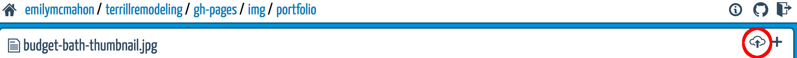
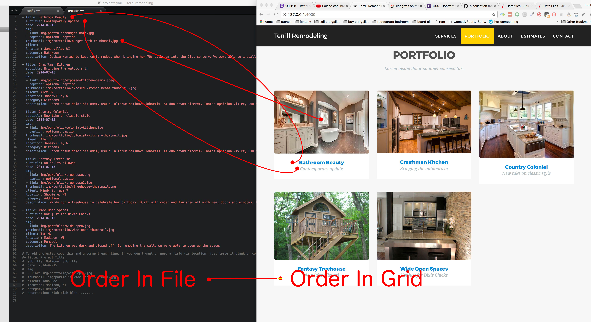
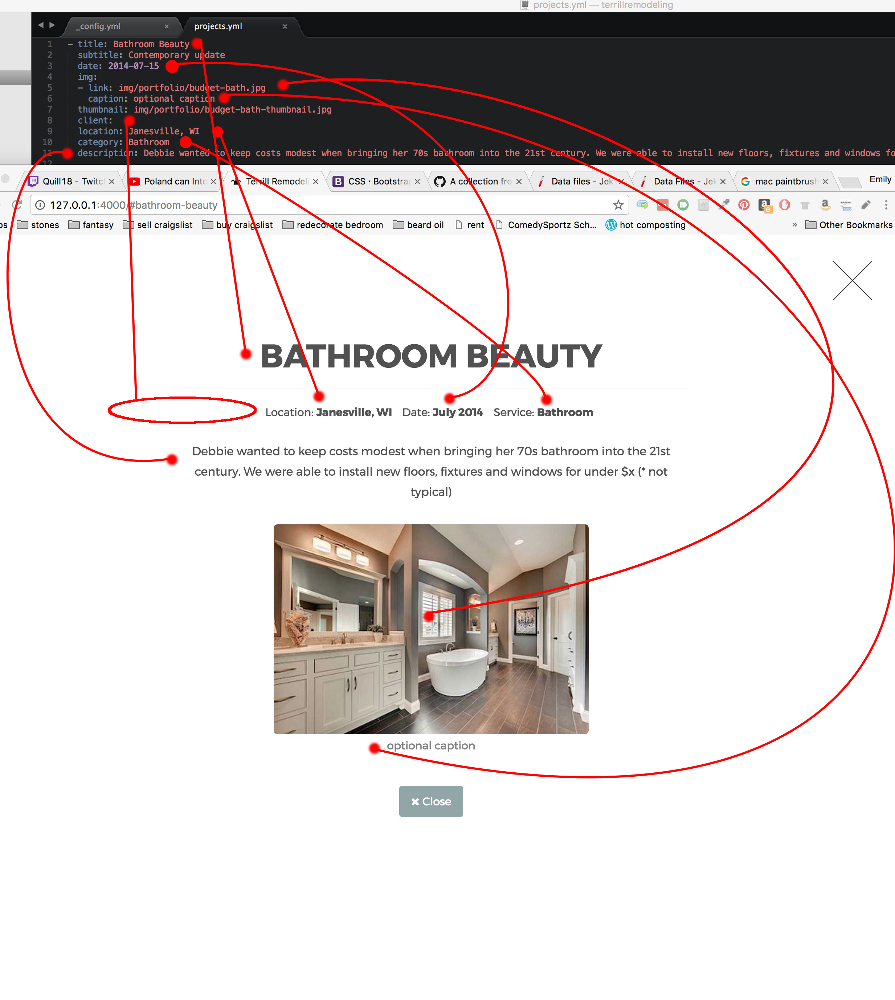

Jekyll site for Terrill Remodeling
====================

Built off [Agency Jekyll Theme](https://github.com/y7kim/agency-jekyll-theme)

# How to edit

Via [content-editor.surge.sh](https://content-editor.surge.sh). Requires personal access token via github and permissions to repo.

# Where to edit

* Color, font, etc, changes can be made in _data/template.yml
* Projects are added to _data/projects.yml
* Project pictures are uploaded to the img/projects folder via content editor 
* Site text is in _config.yml

# Projects

Here's how the file entries correspond to projects in the grid



Here's how the file entries correspond to the detailed view


* Note Client is empty, so it doesn't show up. If date, location or category were blank they would not show up as well.
* You have have as many pictures as you want. See the Treehouse project for an example with > 1 picture
* The indentation is important. The first line of each project should begin with a "-" with no spaces preceeding. Each subsequent line should have exactly two spaces, with the only exception being image captions which need 4 spaces.


# Steps to Add Project

1. Create the thumbnail image that is approximately 360px wide and 260px high.If your thumbnail images are different than 360px x 260px the grid might look weird. You can use [picresize](http://picresize.com/) to do this. Before you resize make sure you crop the image so it's 1) focused on the part of the picture you want and 2) approximately the correct proportioned rectangle. If you don't have the correct porportions when you resize, the image will stretch and shrink and could look unprofessional.
2. Via content editor, upload all the images (including thumbnail) in the img/portfolio folder. See above for pic.
3. Via content editor, edit the _data/projects.yml file to include the new project. You'll need to refer to the pictures you just uploaded by filename. You can copy/paste this in as a starting point
``` 
- title: Project Title
  subtitle: Optional Subtitle
  date: 2014-07-15
  img: 
  - link: img/portfolio/wide-open.jpg
  thumbnail: img/portfolio/wide-open-thumbnail.jpg
  client: John Doe
  location: Madison, WI
  category: Remodel
  description: Blah blah blah.........
```
4. Save your changes, wait a bit, then verify [the site](terrillremodeling.emilymcmahon.com) has changed.